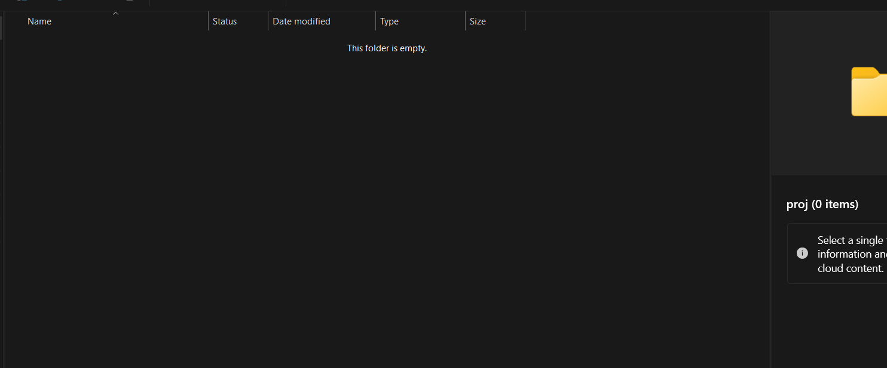
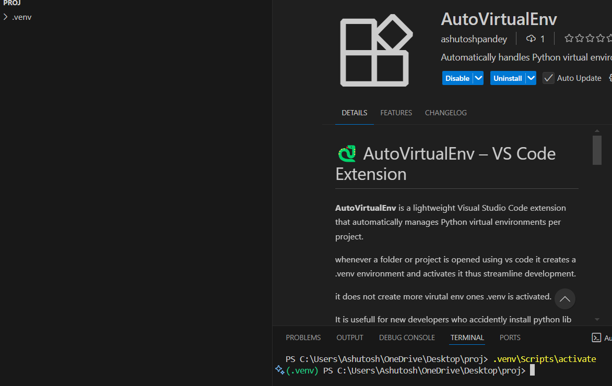

# 🐍 AutoVirtualEnv – VS Code Extension

**AutoVirtualEnv** is a lightweight Visual Studio Code extension that automatically manages Python virtual environments per project.

whenever a folder or project is opened using vs code it creates a .venv environment and activates it thus streamline development.

it does not create more virutal env ones .venv is activated.

It is usefull for new developers who accidently install python lib globally while developing projects.

---

### 🚀 Features

- ✅ Detects if a `.venv` virtual environment exists in the project
- 🆕 Automatically creates a `.venv` if not found
- ⚙️ Activates the virtual environment in the terminal
- 🔚 Deactivates when VS Code session ends

---

### 📦 Installation

#### From Visual Studio Code Marketplace

1. Open **VS Code**
2. Go to the **Extensions** tab (Ctrl + Shift + X)
3. Search for: `AutoVirtualEnv`
4. Click **Install**

Or install using the CLI:

code --install-extension ashutoshpandey.autovirtualenv

🧠 How It Works
On workspace open:

Checks if .venv/ exists
If not → runs: python -m venv .venv
Activates the environment in the terminal:
Windows: .venv\Scripts\activate
Linux/Mac: source .venv/bin/activate
Deactivates automatically when the terminal closes or VS Code exits

🛠️ Usage
Open the Command Palette (Ctrl+Shift+P) and run:

AutoVirtualEnv: Run Python in Virtual Env

📁 Project Structure

autovirtualenv/
├── src/
│   └── extension.ts
├── package.json
├── README.md
├── tsconfig.json
├── esbuild.js
└── ...
📃 License
This project is licensed under the MIT License.

👤 Author
Created by Ashutosh Pandey